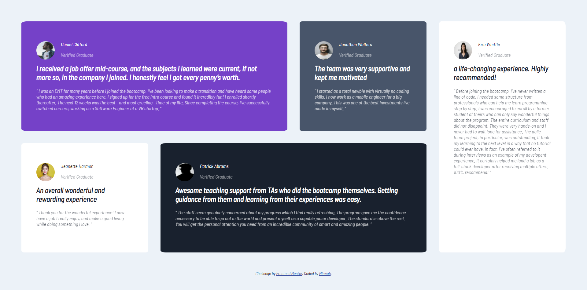

# Frontend Mentor - Testimonials grid section solution

This is a solution to the [Testimonials grid section challenge on Frontend Mentor](https://www.frontendmentor.io/challenges/testimonials-grid-section-Nnw6J7Un7). Frontend Mentor challenges help you improve your coding skills by building realistic projects.

## Table of contents

- [Overview](#overview)
  - [The challenge](#the-challenge)
  - [Screenshot](#screenshot)
  - [Links](#links)
- [My process](#my-process)
  - [Built with](#built-with)
  - [What I learned](#what-i-learned)
  - [Continued development](#continued-development)
  - [Useful resources](#useful-resources)
- [Author](#author)
- [Acknowledgments](#acknowledgments)

## Overview

The challenge was to make a responsive testimonials layout

### The challenge

Users should be able to:

- View the optimal layout for the site depending on their device's screen size

### Screenshot


</br>
</br>


### Links

- Solution URL: [Add solution URL here](https://github.com/obeymyshinnyrod/Frontend-Mentor-challenges/edit/main/testimonials-grid-section-main/style.css)
- Live Site URL: [Add live site URL here](https://testimonials-grid-challenge-six.vercel.app/)

## My process

### Built with

- Semantic HTML5 markup
- CSS custom properties
- CSS Grid

### What I learned

# using @media for reposnive layout based on screen size

```css
@media (max-width: 375px) {
  grid-template-areas: "q" "w" "e" "a" "s" "d";
}
```

### Continued development

I still wanna add the background quote mark on the first testimonial
